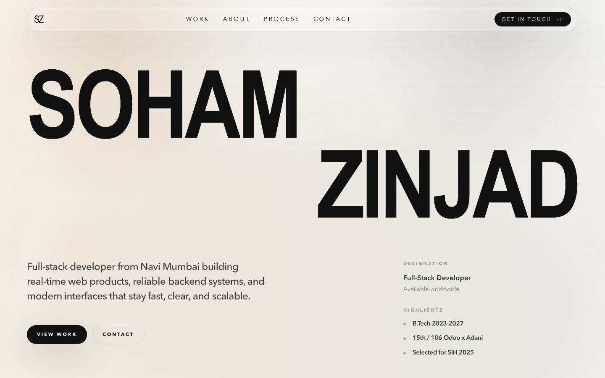
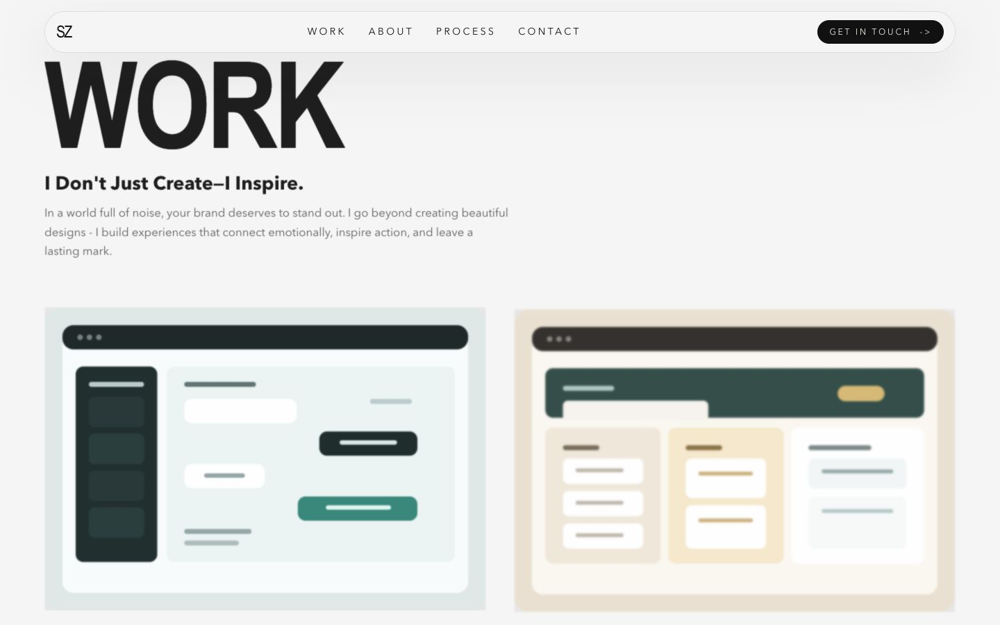

# Creative Developer Portfolio

A premium, modern portfolio website built with **Next.js**, **Tailwind CSS**, **GSAP**, and **Framer Motion**. It features a high-end "creative agency" aesthetic with smooth, staggered mask-reveal animations, custom cursor interactions, and responsive design.

## Previews

### Hero Section


### Projects Section


## Tech Stack

- **Framework:** [Next.js 14](https://nextjs.org/)
- **Styling:** [Tailwind CSS](https://tailwindcss.com/)
- **Animations & Interactions:**
  - [GSAP (GreenSock Animation Platform)](https://gsap.com/)
  - [Framer Motion](https://www.framer.com/motion/)
- **Language:** TypeScript

## Features

- **Premium Agency Aesthetic:** Minimalist UI with sophisticated interactions.
- **Custom Cursor:** Interactive "VIEW" cursor that responds to hover states on projects.
- **Smooth Animations:** Staggered text reveals, parallax scrolling, and seamless transitions.
- **Intro Sequence:** A clean, initial loader animation.
- **Fully Responsive:** Optimized across desktop, tablet, and mobile viewing.

## Getting Started

1. Clone this repository and install the dependencies:
   ```bash
   npm install
   # or
   yarn install
   # or
   pnpm install
   ```

2. Run the development server:
   ```bash
   npm run dev
   # or
   yarn dev
   # or
   pnpm dev
   ```

3. Open [http://localhost:3000](http://localhost:3000) with your browser to see the result.
